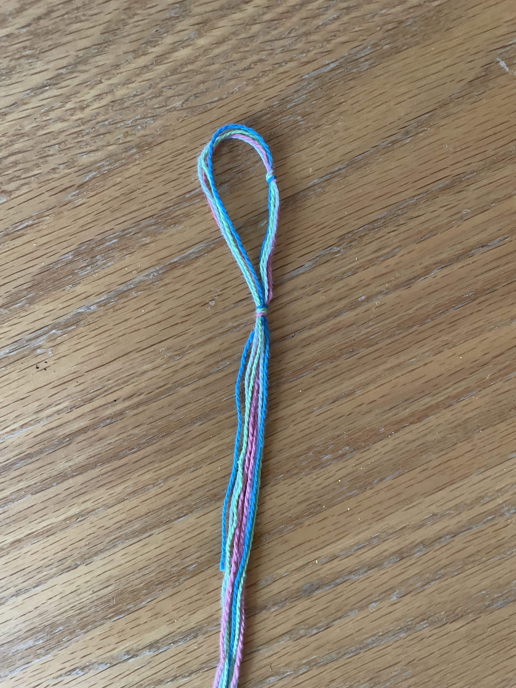
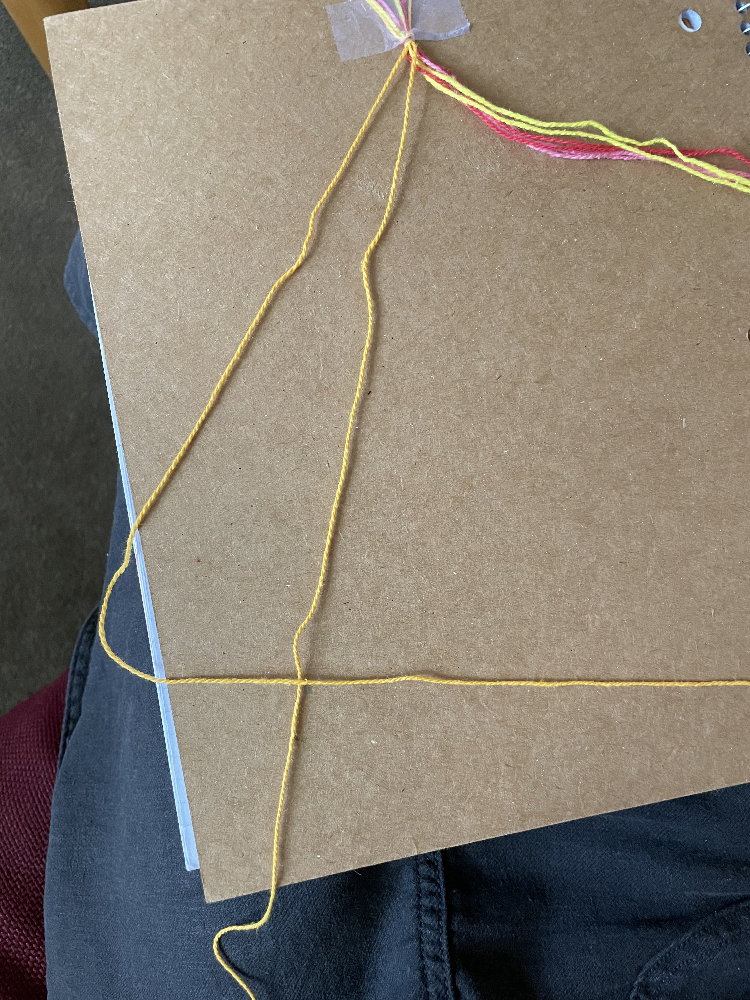
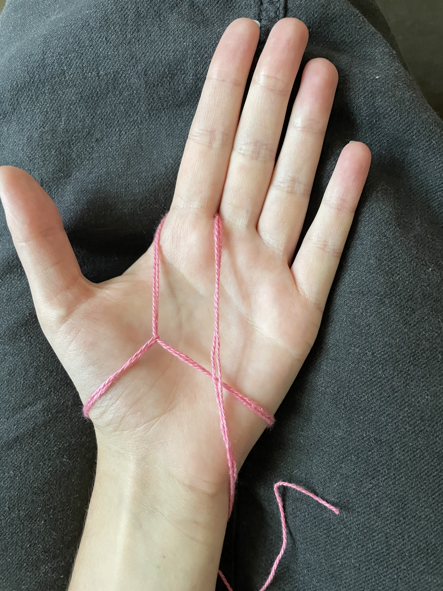
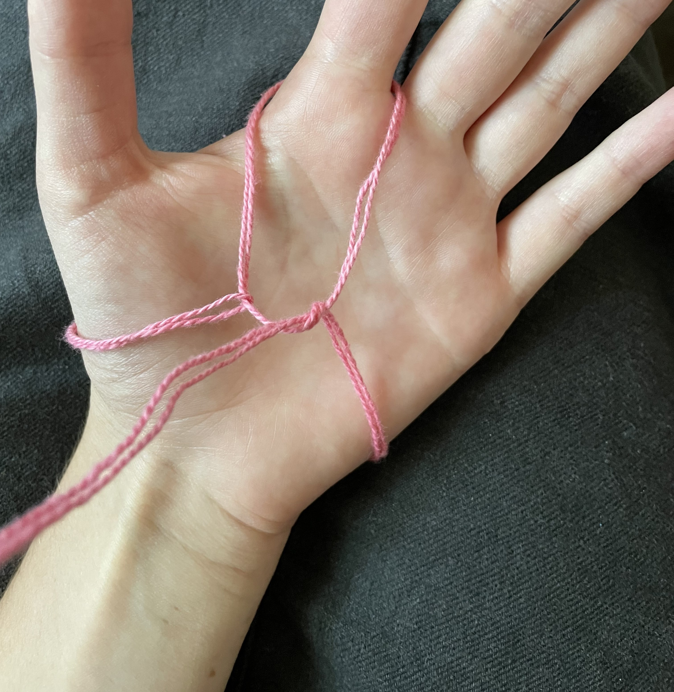

# How to Make a Friendship Bracelet
Friendship bracelets are a halmark of crafts and are notorious amongst young girls. While friendship bracelets can take numerous forms, today I will teach you how to make a simple friendship bracelet from string. 

## Materials

- Embroidery Floss, preferably in four different colors of your choice.
- Scissors
- Tape
- Notebook or clipboard

## Prep the String

1. Take your string and cut about 50" of string of each color.

## Make the Knot
2.  Find the middle of all four pieces of string, and put them together, take this center point and create a knot that makes a loop.

## Make the Bracelet
3. Take the first string on the left and cross it over the string directly to its right, and a make a 4. 
4. Pull the tail of the string crossing over through the hole in the 4 creating a forward knot. Repeat this step.

5. Taking the string you just pulled through the 4 to create a forward knot, move on to the next string to the right that has no knots on it, and make two forward knots on this string.
6. Repeat this process until you have made knots on all strings.
Image of completed row here.
7. Take the string that is now the first string on the left and continue to move to the right and making two forward knots on each string, continue this process until you reach the desired length of your bracelet.

## Ending the Bracelet
8. Take the strings off of your notebook/clipboard and wrap it around your wrist.
9. Take the tail end of the bracelet and pull it through the loop at the top. 

10. Make a loop with the tail end of the string that goes over the string around your wrist, then pull the tail end of the string under the string around your wrist and through the loop you just created.

11. Cut off excess string.

